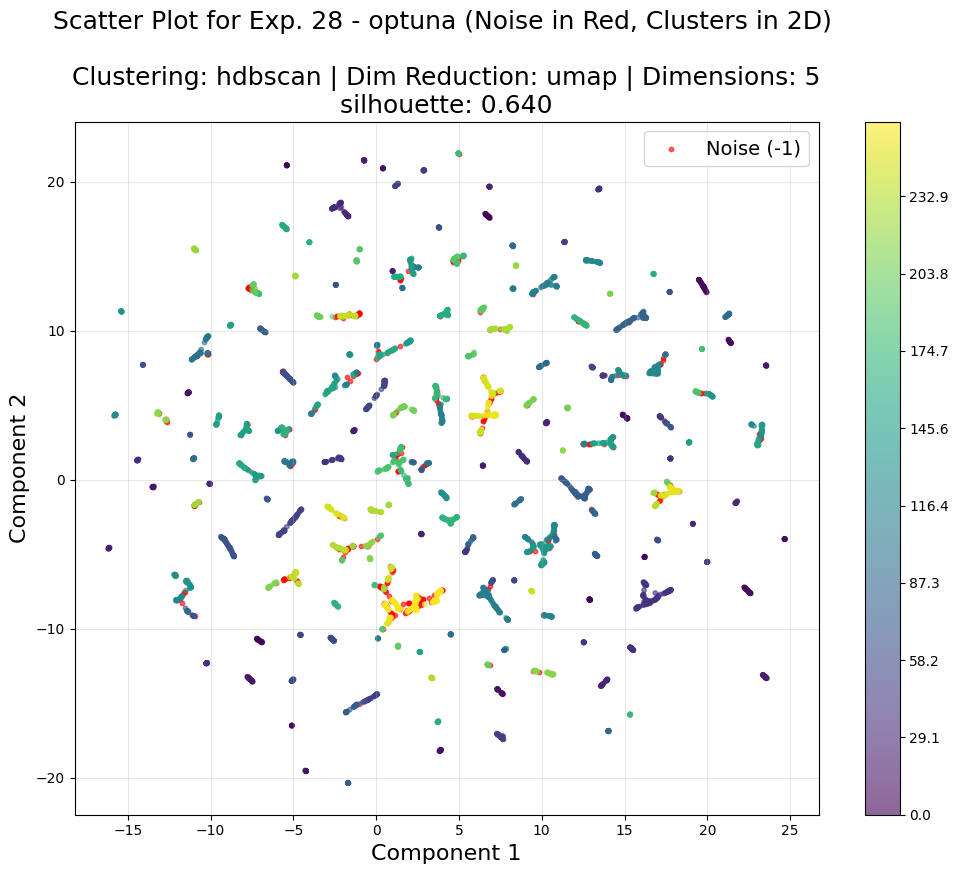
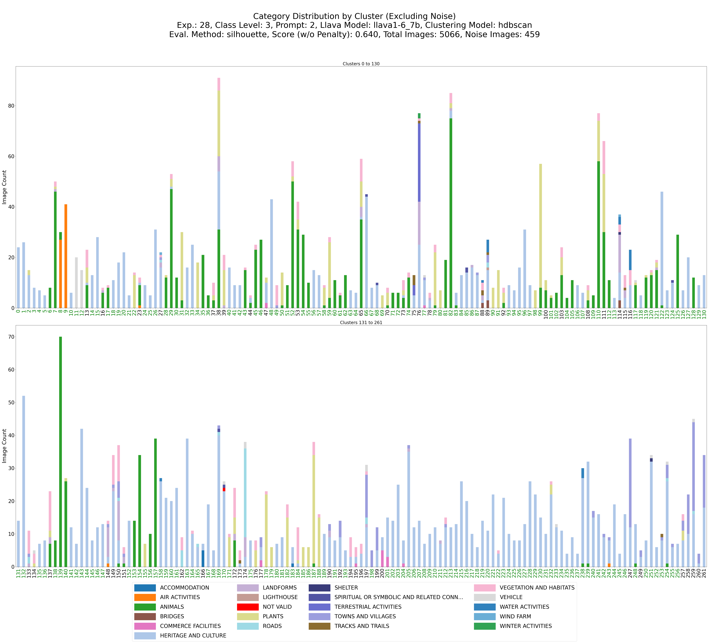

# Guiding Unsupervised social media images Classification, with LVM and LVLM
The connection between nature and human well-being is well-recognized, with studies highlighting its cultural, emotional, and recreational benefits. However, identifying how these benefits manifest and understanding users of natural spaces remains a challenge. Social media image datasets provide valuable insights into this interaction, despite their diverse and complex content.

Advances in AI, particularly Vision Transformers and multimodal models like LLaVA, enable efficient analysis of large, unlabeled datasets. Tools such as DinoV2 and HDBSCAN clustering algorithms help classify and group images, combining geometric and semantic insights.

This Master’s thesis develops a framework using Deep Learning to analyze social media images, clustering and auto-labeling them to study human-nature interactions. Findings show that noise-aware clustering with advanced models achieves effective categorization. The project advances understanding of nature’s benefits and demonstrates AI’s potential for managing and preserving natural environments.

## Project Overview

The project aims to "guide" the unsupervised classification of social media images by leveraging the latest technologies in Deep Learning and Machine Learning. The proposed pipeline consists of the following steps. The use case under study, *Nature's Contributions to People*, serves as the context to apply and evaluate the methodology. A dataset of 5066 unlabeled images from social media (Flickr) is used, with the goal of categorizing these images at different classification levels to enable further analysis. Since no Ground Truth is available, a four-stage unsupervised approach is adopted:

1. **Embedding Extraction**: Generate vector representations of the images using a pre-trained Large Vision Model (DinoV2), with both small and base models offering 384 and 768 dimensions, respectively.
   
2. **Dimensionality Reduction and Clustering**: Apply classical clustering algorithms to the embeddings, resulting in image groupings with high similarity.

3. **Synthetic Labeling**: Use a pre-trained Large Vision Language Model (LLaVA-1.6) to infer labels for images through various prompts containing predefined categories.

4. **Mapping and Evaluation**: Map labels to images and clusters, evaluating cluster quality, homogeneity, and labeling accuracy. This step identifies clusters with strong "semantic homogeneity" while highlighting those requiring further refinement and supervision for final labeling.

This pipeline combines advanced AI techniques to explore unsupervised classification while assessing the quality of clustering and labeling to improve understanding of Nature's Contributions to People.

## Project Summary

This project highlights the potential of Large Vision Models (LVMs) for extracting image features via embeddings and the advancements of Large Vision Language Models (LVLMs) in multimodal labeling through prompt engineering. Using HDBSCAN with noise optimization, highly detailed clustering is achieved, distinguishing, for example, insect families such as arachnids and dragonflies. This opens the door for the level of granularity in classification to be even greater than what was initially addressed, which was already broad with 26 fixed categories.

Dimensionality reduction, essential for clustering algorithms, was performed using UMAP and other methods like t-SNE and PCA. While most algorithms perform best with 2D reductions, HDBSCAN achieved strong geometric and semantic results with 4–5 dimensions using DinoV2 Base and UMAP dim reduction, preserving more information.

The project integrates various data science technologies, including classical Machine Learning for unsupervised learning, Deep Learning models (LVMs and LVLMs), hyperparameter optimization using Optuna Framework, data manipulation, custom metrics, and dual validation approaches, demonstrating the synergy of these tools in unsupervised classification.

## Examples

The images below illustrate examples of high-quality semantic clustering achieved in some experiments, along with effective noise detection.

Cluster 16 - Experiment 28 - Animals

  

Cluster 0 - Experiment 28 - Heritage and culture

  

Cluster -1 - Experiment 28 - Detected Noise

